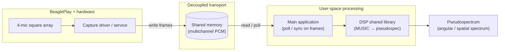

# rt_music

Real-time **MUSIC** (Multiple Signal Classification) direction finding in C++: estimate where a dominant source (for example human speech) is coming from, with a path from offline-capable DSP through embedded deployment on **BeaglePlay**.

---

## Vision and end-to-end architecture

The **target platform** is BeaglePlay with a **four-microphone array** laid out in a **square** (planar geometry). Audio is acquired in real time, handed off to processing without tight coupling between the capture path and the algorithm, and reduced to a **pseudospectrum** over candidate directions—the curve MUSIC uses to infer source bearings.

**Hardware capture path.** A dedicated **driver or capture service** talks to the microphones (I²S, TDM, or board-specific audio fabric), timestamps or sequences frames, and **writes multichannel PCM into shared memory** (for example a POSIX shared-memory segment or memory-mapped ring buffer). That layer is responsible for low-latency, continuous ingestion and for exposing a stable layout (four channels, frame alignment, sample rate).

**Main processing application.** A user-space **main app** does not drive the ADC directly; it **polls or blocks on the shared-memory buffer**, assembles short overlapping windows per channel, and calls into the **DSP library** to compute the **pseudospectrum** from the current covariance / subspace estimate. The app may also handle calibration, steering-vector lookup, and output (logging, network, or UI).

**DSP library role.** The heavy linear algebra and MUSIC-specific steps (spatial covariance, noise subspace, steering vectors, spectrum evaluation) live in a **shared library** so the same code can be unit-tested on a workstation, linked into the BeaglePlay image, and upgraded without re-flashing the capture driver.

Together: **microphones → driver → shared memory → main processor (poll) → DSP shared library → pseudospectrum.**



---

## Development roadmap

### Step 1 (current focus): DSP shared library — planar square 2×2 array

Before wiring the on-board capture stack, the first milestone is a **shared library** (DSP / “dsp-music” layer) that implements **pseudospectrum computation** for a **uniform planar square** microphone grid (**2×2**, four channels), with steering vectors precomputed for **azimuth in the array plane** (single-angle pseudospectrum). In this repository that corresponds to the **`MusicDsp`** shared target under `src/lib` (installed headers under `music-dsp`).

Repository layout today centers on this library with tests and precomputed steering data; integration with shared memory and the BeaglePlay driver comes after the library API and numerical behavior are solid.

### Later steps (toward the final stage)

- Extend steering / spectrum to **full 2D DOA** (azimuth and elevation or u–v) where a single-angle sweep is not enough.
- Implement or integrate the **shared-memory capture** contract and the **polling main app** on the target OS image (embedded image / BSP as needed).
- Tune frame sizes, sample rate, and real-time scheduling for stable latency on BeaglePlay.

---

## Description (concise)

The project implements a **real-time-capable** variant of the MUSIC algorithm, aimed at running on **BeaglePlay**, so the system can resolve **direction of a dominant source** (e.g. speech). The long-term picture is **four microphones on a square grid**, **driver-fed shared memory**, and a **main application** that consumes that stream and produces a **pseudospectrum** via a **shared DSP library**.

---

## Getting Started

### Catch2

```
cd ext/Catch2
cmake -B Build -S . -DBUILD_TESTING=OFF
sudo cmake --build Build/ --target install
```

### Precompute arrays

```
cd precompute_steering_vectors
./generate_steering_vectors.sh
```

### Build ut

```
mkdir ut/build && cd ut/build
cmake -GNinja ..
ninja && ctest -R ".*"
```

### Yocto / embedded image (optional)

Large upstream layers (**poky**, **meta-openembedded**, **meta-arm**, **meta-ti**, …) are **not** submodules in this repo so `git submodule update` does not pull them. The in-tree **`yocto/meta-music`** directory is a BSP layer you can copy or add-layer from your own Yocto tree (after you clone poky and dependencies elsewhere). Point `bitbake-layers add-layer` at the absolute path to `meta-music` and follow your BSP’s docs for `MACHINE` and dependencies.
